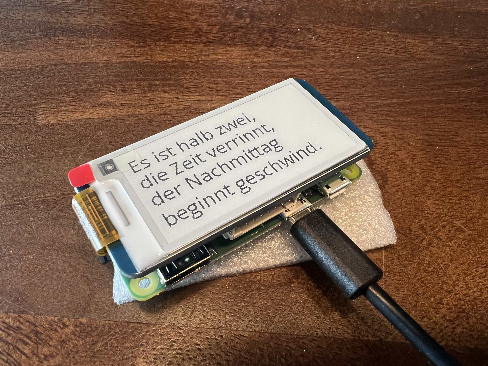

# clockwork/ai

>
> This project is inspired by creative mind Matt Web and his [Poem/1](https://poem.town/) clock. 
> 

Simple diy clock project to generate ai poems by current time.

> Am Horizont, wo Lichter blüh'n,<br/>
> zeigt die Uhr 17:17, in Abendglüh'n.



## functions

General functionalities of the python app:

- `python3 clockwork` - generates ai poem of current time
- `python3 clockwork clear` - clear display
- `python3 clockwork demo` - demo poems to display
- `python3 clockwork storage` - demo storage write and read process
- `python3 clockwork display <text>` - display custom text
- `python3 clockwork ask <question>` - ask custom question to ai and display answer

The storage component stores the received poems to json files, e.g. `var/12/1245.json`. If the environment variable `CLOCKWORK_REUSE` is set to true, the algorithm randomly uses stored poems instead of calling the api to reuse them. 

## project log

### hardware

- raspberry pi zero 
- waveshare 2.13inch e-Paper

### links

- based on the waveshare [tutorial](https://www.waveshare.com/wiki/2.13inch_e-Paper_HAT_Manual#Python)
- see installation instructions for needed libraries


### prerequirements

- api key from openai: https://platform.openai.com/api-keys

### installation

```bash
# get python app
git clone https://github.com/jackd248/clockwork-ai.git
cd clockwork-ai
# install python requirements
pip3 install -r requirements.txt
# prepare settings and store own openai api key!
cp .env.dist .env
# run demo
python3 clockwork demo
```

### permanent setup

Setup a periodic cronjob to update the poem e.g. every minute:

```bash
crontab -e
```

```cronexp
* * * * * python3 /path/to/clockwork/dir clockwork
```

Or setup a cronjob to update the poem on daytime:

```cronexp
* 06-23 * * * python3 /path/to/clockwork/dir clockwork
10 23 * * * python3 /path/to/clockwork/dir clockwork clear
```

> Note that you should clear the e-ink screen to avoid display issues.

### configuration

You can adjust the default openai prompt to adjust the poem results or the desired language if you edit the environment variable `OPENAI_CLOCKWORK_PROMPT` within your `.env` file:
```dotenv
OPENAI_CLOCKWORK_PROMPT="You are a clock that shows the time in a two-line poem."
```

If you want to compare current time with the generated poem, activate the `CLOCKWORK_SHOW_TIME` environment variable to display the time in the bottom right corner.