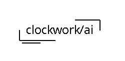
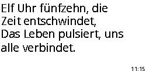
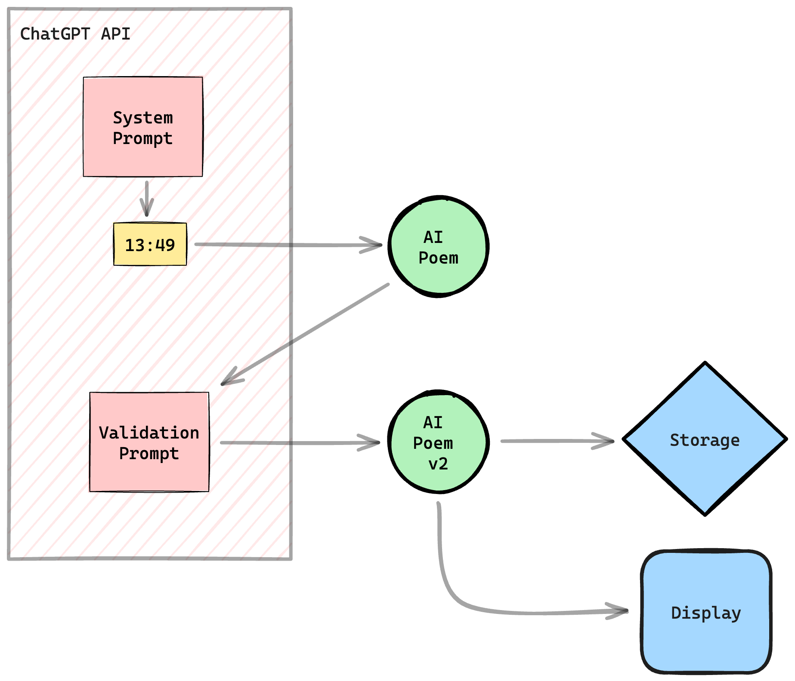

# clockwork/ai



>
> This project is inspired by creative mind Matt Web and his beautiful [Poem/1](https://poem.town/) clock. 
>

Simple DIY clock project to generate AI poems by current time using a raspberry pi zero + e-ink display.



- [General](#general)
    * [Reuse](#reuse)
    * [Lock](#lock)
- [Installation](#installation)
    * [Hardware](#hardware)
    * [Preparation](#preparation)
    * [Prerequirements](#prerequirements)
    * [Software](#software)
    * [Permanent setup](#permanent-setup)
- [Configuration](#configuration)
    * [Hardware support](#hardware-support)
    * [Prompt](#prompt)
    * [Validation](#validation)
    * [Show time](#show-time)
    * [Font](#font)
    * [Debug](#debug)
- [Development](#development)
- [Project log](#project-log)
- [Disclaimer](#disclaimer)

## General

Currently forced for german language, but can be adjusted for custom usage, see [Configuration](#Configuration). 

### Features

- generate an AI poem about the current time and display them on an e-ink display
- display custom messages on the e-ink display
- clear the e-ink display

### Demo

See a live demo here: https://jackd248.github.io/clockwork-ai/.

### Commands

General command line functionalities of the python app:

- `python3 clockwork` - generates ai poem of current time
- `python3 clockwork 09:41` - generates ai poem of a requested time
- `python3 clockwork clear` - clear display
- `python3 clockwork demo` - demo poems to display
- `python3 clockwork display <text>` - display custom text
- `python3 clockwork ask <question>` - ask custom question to ai and display answer

The `--dry-run` option prevent the display process on the e-ink display and generates images instead under `var/debug/`.

### Reuse

The fs component stores the received poems to json files, e.g. `var/storage/12/1245.json`. If the environment variable `CLOCKWORK_REUSE` is set to true, the algorithm randomly uses stored poems instead of calling the api to reuse them. 

The script also checks if an internet connection is available to call the api. If not so, the script will show a stored poem if available for some kind of offline usage. 

### Lock

The file lock prevents the multiple execution of the python script, because this can result in display issues. 

## Installation

### Hardware

- [raspberry pi zero](https://www.raspberrypi.com/products/raspberry-pi-zero/)
- [waveshare 2.13inch e-Paper](https://www.waveshare.com/wiki/2.13inch_e-Paper_HAT)


### Preparation

- based on the waveshare [tutorial](https://www.waveshare.com/wiki/2.13inch_e-Paper_HAT_Manual#Python)
- see installation instructions for needed libraries
- or use [init.sh](init.sh) to install system dependencies

```bash
sh init.sh
```


### Prerequirements

- api key from openai: https://platform.openai.com/api-keys

### Software

```bash
# get python app
git clone https://github.com/jackd248/clockwork-ai.git
cd clockwork-ai
# install python requirements
pip3 install -r requirements.txt
# prepare settings and store own openai api key!
cp .env.dist .env
# run demo
python3 clockwork demo
```

### Permanent setup

Set up a periodic cronjob to update the poem e.g. every minute:

```bash
crontab -e
```

```cronexp
* * * * * python3 /path/to/clockwork/dir clockwork
```

Or set up a cronjob to update the poem on daytime:

```cronexp
@reboot python3 /path/to/clockwork/dir clockwork intro
* 06-23 * * * python3 /path/to/clockwork/dir clockwork
10 23 * * * python3 /path/to/clockwork/dir clockwork clear
```

> Note that you should clear the e-ink screen to avoid display issues.

## Configuration

All configuration options are available within your `.env` file.

### Hardware support

Currently, the both displays are supported:

- 2.13inch e-Paper: `epd2in13`
- 7.5inch e-Paper: `epd7in5`

Change the `CLOCKWORK_DISPLAY` environment variable to the used hardware component.

### Prompt

You can adjust the default openai prompt to adjust the poem results or the desired language if you edit the environment variable `OPENAI_CLOCKWORK_SYSTEM_PROMPT` within your `.env` file:
```dotenv
OPENAI_CLOCKWORK_PROMPT="You are a clock that shows the time in a two-line poem."
```

### Validation

To improve the poem results by the ai, you can validate the response from the api again by the ai enabling the environment variable `CLOCKWORK_VALIDATE`. Therefore, a second request is sent to openai with the initial conversation messages and additional the `OPENAI_CLOCKWORK_VALIDATION_PROMPT`. 

### Show time

If you want to compare current time with the generated poem, activate the `CLOCKWORK_SHOW_TIME` environment variable to display the time in the bottom right corner.

### Font

Download a custom TrueType font (e.g. at https://fonts2u.com/), save them within the `font` directory and adjust the `CLOCKWORK_FONT` environment variable to adjust the displayed font. 

### Debug

Use the environment variable `CLOCKWORK_DEBUG` to enable file log for more debug information under e.g. `var/log/app_2024-02-23.log`. 

Also, a little dot is displayed in the upper right corner if a poem is reused instead of calling the openai api.

## Development

Use [docker](https://www.docker.com/) and [docker-compose](https://docs.docker.com/compose/) for a development context to work on the app.

Build docker container:

```bash
docker compose up --build
```

Run python app within dev service:

```bash
docker-compose run dev
$ python3 clockwork demo --dry-run
$ python3 clockwork display "Test" --dry-run
```

Use pylint to improve code quality:
```bash
docker-compose run dev
$ pylint clockwork
```

## Project log

### Concept

This graphic shows the request chain for generating the AI poem by the chatgpt api:



### Prompt history

@ToDo

## Disclaimer

The waveshare libraries are part of the [e-Paper](https://github.com/waveshareteam/e-Paper) repository. 